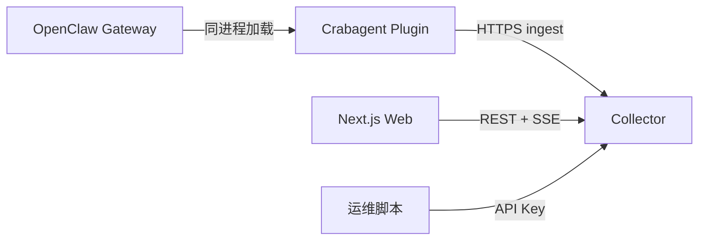

# Crabagent 技术设计文档

| 属性 | 说明 |
|------|------|
| 文档类型 | 技术设计（TDD / 实现蓝图） |
| 关联文档 | [产品设计](./PRODUCT_DESIGN.md)、[架构与数据流](./architecture.md)、[Token 优化](./product-token-optimization.md) |
| 状态 | 与架构定稿 v1.1 对齐；接口细节以 OpenAPI 仓库或 `openapi.yaml` 为准（待生成） |

---

## 1. 系统上下文



- **信任边界**：插件运行在 OpenClaw 进程内，持有 **Collector API Key**；Collector 与 Web 部署在内网或云端 VPC。  
- **数据流**：事件 **上行** ingest；**不下行**控制 OpenClaw 运行时（MVP）。

---

## 2. 逻辑架构

详见 [architecture.md](./architecture.md) 第 1 节图与第 4 节定稿；图源文件：`diagrams/project-architecture.mmd`。

**三层组件**：

1. **openclaw-trace-plugin**（独立 npm）  
2. **collector**（HTTP 服务 + SQLite + Token 优化内嵌模块）  
3. **web**（Next.js App Router）

---

## 3. 插件（openclaw-trace-plugin）

### 3.1 技术约束

- **仅**使用 `openclaw/plugin-sdk/*` 公共面；**禁止** `import` 宿主 `src/**`。  
- `peerDependencies` 声明与目标 `openclaw` 主版本兼容范围。

### 3.2 订阅的 Hook（定稿）

| Hook | 用途 |
|------|------|
| `llm_input` | Turn 级：system、prompt、historyMessages、runId、sessionId、provider、model |
| `llm_output` | Turn 结束：assistantTexts、usage、lastAssistant |
| `agent_end` | messages 快照、success、error、durationMs |
| `before_tool_call` / `after_tool_call` | Tool span |
| `before_compaction` / `after_compaction` | Compaction 前后 |
| `subagent_spawned` / `subagent_ended`（及 delivery 相关若需） | 合并 `trace_root_id` |
| `session_start` | 按 session **采样**决策（确定性哈希） |

### 3.3 每跳模型请求（per-model）

- **来源**：tail 宿主 **`cache-trace.jsonl`**，解析 `stage === "stream:context"`（字段以 OpenClaw `CacheTraceEvent` 为准）。  
- **失败/缺失**：上报 `capabilities.per_model_call = false`，仍发 turn 级事件。

### 3.4 内部流水线

1. **Hook / tail 回调**：只做 **序列化 + 入内存队列**（有界）；禁止 `await fetch`。  
2. **Flush Worker**（同进程定时或批量触发）：gzip 批量 **POST** `Collector /v1/ingest`（路径前缀可配置，此处为建议）。  
3. **失败**：写入 **网关本机 SQLite Outbox** 表；Worker 重试，成功后删除或标记 ack。  
4. **trace_root_id**：在内存维护 `sessionKey → trace_root_id` 与子代理父子关系；随事件一并发送。

### 3.5 配置项（建议）

| 键 | 说明 |
|----|------|
| `collector.baseUrl` | HTTPS 根 URL |
| `collector.apiKey` | 或引用 secret |
| `sqlitePath` | Outbox 文件路径 |
| `sampleRateBps` | 万分比采样，按 session 固定 |
| `memoryQueueMax` | 内存队列上限 |
| `flush.batchSize` / `flush.intervalMs` | 批量参数 |
| `cacheTrace.path` | 可选覆盖默认 jsonl 路径 |

---

## 4. Collector 服务

### 4.1 技术选型建议

- **运行时**：Node 22+ 或 Bun（与团队统一）。  
- **框架**：Fastify / Hono 等轻量 HTTP（实现阶段选定）。  
- **DB**：SQLite（`better-sqlite3` 或 `sql.js`+持久化，按团队定）；**WAL** 开启。  
- **文档**：OpenAPI 3.1 生成路由或反向维护 `openapi.yaml`。

### 4.2 模块划分

| 模块 | 职责 |
|------|------|
| **auth** | Bearer / `X-API-Key` 校验；人机 JWT/Cookie 由 Web BFF 或 Collector 同源实现（实现二选一，定稿为「分离」：浏览器会话 vs 机器 Key） |
| **ingest** | 校验、解压、幂等、批量写入 `events` |
| **query** | Trace 列表、详情、session 解析 `trace_root_id` |
| **sse** | `GET /v1/traces/:traceRootId/stream`，按 `trace_root_id` 扇入新事件 |
| **admin** | API Key 管理、删除 session（需权限模型） |
| **tokopt** | 策略 CRUD、规则引擎、节省估算（读聚合数据） |

### 4.3 定稿 API 轮廓（路径为建议，实现以 OpenAPI 为准）

| 方法 | 路径 | 说明 |
|------|------|------|
| POST | `/v1/ingest` | 插件上报；Body gzip；幂等键 `event_id` 或批量 `batch_id` |
| GET | `/v1/traces` | 列表查询 |
| GET | `/v1/traces/:traceRootId` | 详情 |
| GET | `/v1/sessions/:sessionId/trace-root` | 解析 `trace_root_id` |
| GET | `/v1/traces/:traceRootId/stream` | SSE |
| DELETE | `/v1/sessions/:sessionId` | 级联删除 |
| `…` | `/v1/policies/*` | Token 优化策略（V1） |
| `…` | `/v1/tokopt/diagnostics/*` | 诊断与估算（V1） |

### 4.4 Ingest 载荷（原则）

- **压缩**：请求 `Content-Encoding: gzip`（或与插件协商 zstd）。  
- **单请求压缩后上限**：**16 MB**（可配置）。  
- **超限**：逻辑拆条：相同 `event_id`，`part_index` / `parts_total`。  
- **幂等**：`(tenant_id, event_id)` 或 `(api_key_id, event_id)` 唯一。

### 4.5 SSE

- **订阅键**：`trace_root_id`。  
- **代理**：Nginx `proxy_buffering off`、`proxy_read_timeout` 足够大。  
- **鉴权**：与 REST 一致（Query token 仅当无法用 Header 时谨慎使用）。

### 4.6 SQLite 表（逻辑模型，非最终 DDL）

| 表 | 用途 |
|----|------|
| `events` | 归一化事件行（含 `trace_root_id`, `session_id`, `type`, `payload_json`, `ts`, `event_id`, `part_index`, `parts_total`） |
| `outbox_plugin` | **可选**：若 Collector 自身也需异步出站则使用；当前定稿 Outbox 在 **网关**，Collector 侧以 ingest 落库为主 |
| `api_keys` | Key 哈希、租户、创建时间、吊销 |
| `policies` / `policy_versions` | Token 优化策略（V1） |
| `tenants` / `users` | 公有云多租户（若 MVP 即多租户） |

索引：`(session_id)`, `(trace_root_id)`, `(ts DESC)`，及查询模式所需复合索引。

---

## 5. Web 控制台（Next.js）

### 5.1 栈

- **App Router**、TypeScript、**next-intl**（`zh-CN` / `en`）。  
- **TanStack Query**、**shadcn/ui**、Tailwind。  
- **EventSource** 订阅 SSE（或封装 hook）。

### 5.2 与 Collector 通信

- **浏览器 → Collector**：同域 BFF 转发 **或** CORS 固定 origin + Bearer（由部署定稿）。内网建议 **反向代理同域** 避免 CORS。  
- **服务端组件**：仅拉公开配置；敏感操作用 Server Action + Cookie 会话。

### 5.3 环境变量（示例）

| 变量 | 说明 |
|------|------|
| `NEXT_PUBLIC_DEPLOYMENT_MODE` | `cloud` \| `self-hosted` |
| `COLLECTOR_INTERNAL_URL` | 服务端请求 Collector |
| `AUTH_*` | OAuth Client ID/Secret 等 |

---

## 6. 事件模型（ingest）

### 6.1 通用信封（建议）

```json
{
  "schema_version": 1,
  "event_id": "uuid",
  "trace_root_id": "string",
  "session_id": "string",
  "session_key": "string | null",
  "run_id": "string",
  "type": "llm_input | model_call | tool_call | ...",
  "ts": "ISO8601",
  "capabilities": { "per_model_call": true },
  "payload": { }
}
```

### 6.2 类型枚举（实现阶段冻结）

与 Hook 及 `stream:context` 字段对齐；`payload` 内保留宿主原始结构子集 + 脱敏策略（若客户要求不落敏感字段，通过策略开关裁剪）。

---

## 7. 安全设计

- **API Key**：仅存 **哈希**（bcrypt/argon2）；传输仅 HTTPS。  
- **插件**：Key 来自 env 或加密本地文件，不写日志。  
- **SQLite 文件权限**：仅运行用户只读/写；备份加密由运维策略规定。  
- **私有化 OAuth**：`state` / PKCE；Redirect URI 白名单。

---

## 8. 部署拓扑

- **最小内网**：单 VM — Gateway（含插件）+ Collector + Web（或静态 + Node SSR），前置 TLS 终止。  
- **扩展**：Collector 与 Web 分机；SQLite 换 **网络文件系统需谨慎**（锁与损坏风险），优先单机 SQLite 或后续 PostgreSQL。

---

## 9. OpenClaw 联调清单

1. `openclaw.json` → `plugins.load.paths` → 插件包绝对路径。  
2. `plugins.entries.<id>.enabled` + `config`。  
3. 启用 **Cache Trace**：`OPENCLAW_CACHE_TRACE` 或 `diagnostics.cacheTrace`。  
4. 全局 `openclaw` 版本与插件 `peerDependencies` 对齐。  
5. 重启 Gateway 使插件与 tail 生效。

---

## 10. Token 优化（技术落点）

- **代码位置**：Collector 进程内 **tokopt** 模块；读 `events` 聚合表或物化视图（实现阶段定）。  
- **V1**：无宿主回调节点；输出 **JSON 配置片段** 供人粘贴至 `openclaw.json`。  
- **V2+**：可选独立服务，见 [architecture.md §4.6](./architecture.md)。

---

## 11. 观测与运维

- Collector：**结构化日志**（请求 id、tenant、ingest 批次大小）。  
- 插件：**debug 级**日志可开关；**禁止**默认打印原文。  
- **指标**（可选）：ingest QPS、队列深度、SSE 连接数、SQLite 大小。

---

## 12. 测试策略

| 层级 | 内容 |
|------|------|
| 单元 | 事件序列化、采样哈希、Outbox 重试逻辑 |
| 集成 | Mock Collector 的 ingest 契约测试 |
| E2E | 可选：Testcontainers + 最小 OpenClaw 场景（成本高，后置） |

---

## 13. 风险与依赖

- **宿主 API 变更**：Hook 签名或 Cache Trace 格式变化 → 插件发 **兼容层** 与版本探测。  
- **大原文**：磁盘与网络膨胀 → 客户侧配额与 TTL 策略（产品配置）。  
- **SQLite 上限**：极高写入下考虑批量事务与分库（或迁 PG）。

---

## 14. 文档修订

| 版本 | 日期 | 摘要 |
|------|------|------|
| v1.0 | （填日期） | 首版，与架构定稿 v1.1 对齐 |
