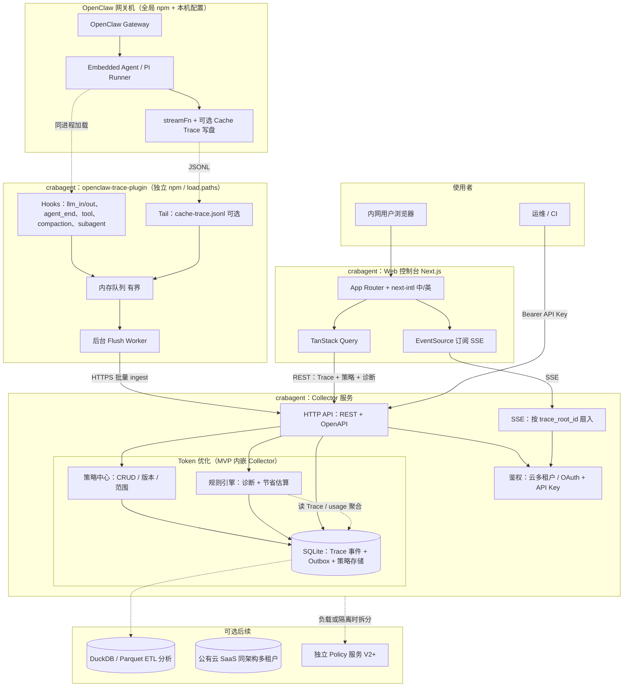
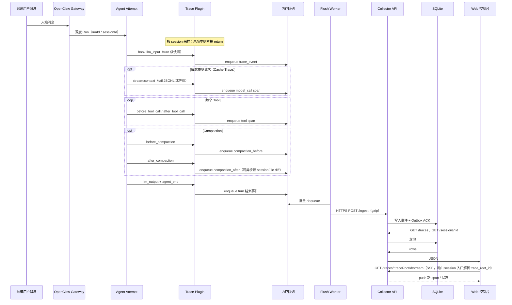
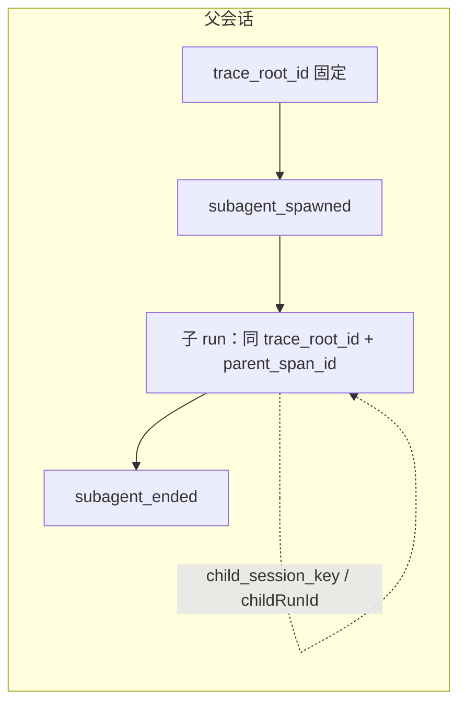
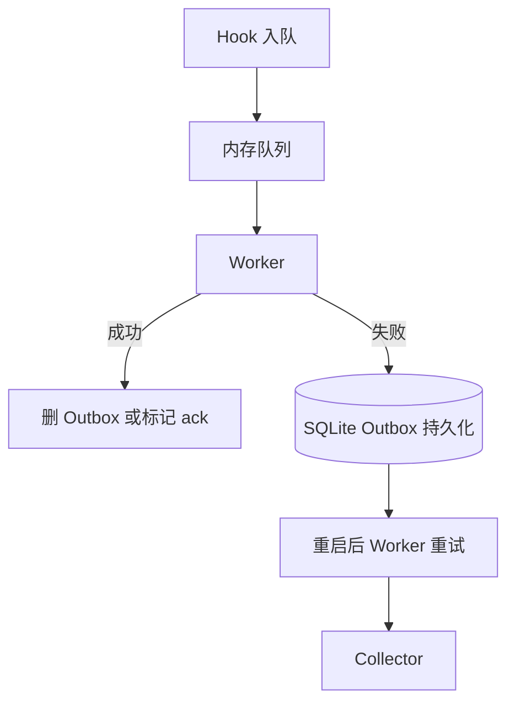
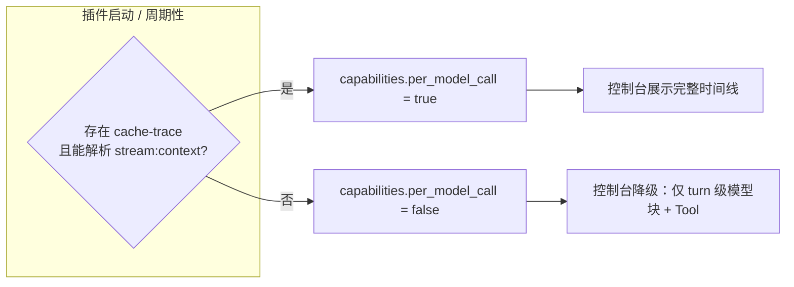

# Crabagent 架构与数据流

本文档描述 Trace 产品与 OpenClaw 联调时的**系统架构**、**数据流程**及**已定稿的决策**（见第 4 节）。图使用 [Mermaid](https://mermaid.js.org/)，可在 VS Code（插件）、GitHub、Notion 等环境中渲染。

**完整规格**： [产品设计](./PRODUCT_DESIGN.md) · [技术设计](./TECHNICAL_DESIGN.md) · [文档索引](./README.md)

**独立图源（`.mmd`，便于 CLI 导出 SVG/PNG）**：

| 说明 | 文件 |
|------|------|
| 项目架构图 | `diagrams/project-architecture.mmd` |
| 数据流程（主序列） | `diagrams/data-flow.mmd` |
| 子代理合并 | `diagrams/data-flow-subagent-merge.mmd` |
| Outbox 续传 | `diagrams/data-flow-outbox.mmd` |
| 能力降级 | `diagrams/data-flow-capabilities.mmd` |

**独立产品文档**：[Token 优化策略](./product-token-optimization.md)（与 §4.6 定稿边界配套）。

导出示例：`npx @mermaid-js/mermaid-cli -i diagrams/project-architecture.mmd -o diagrams/project-architecture.svg`

---

## 1. 项目架构图（组件与边界）

### 读图要点

- **插件与 Gateway 同进程**：Hooks 极轻，只入队；不在 Hook 内做阻塞网络 IO。
- **Collector 与 Gateway 可不同机**：内网 HTTPS；插件配置 Collector URL + API Key。
- **Web 只连 Collector**，不直连 SQLite、不直连 OpenClaw。

---

## 2. 数据流程图

### 2.1 端到端主流程（序列图）

### 2.2 子代理合并到父 Trace

- 所有事件携带 **`trace_root_id`**；子代理事件额外携带 **`parent_span_id`**，UI 按时间线合并为一条主 Trace。

### 2.3 断网续传（Outbox）

---

## 3. 变体兼容 / 能力降级

---

## 4. 架构定稿（决策记录）

以下为当前版本的**正式决策**，实现与文档以本节为准；若变更需更新版本说明。

### 4.1 Ingest：直写 Collector + 网关内 SQLite Outbox（MVP）

- **模式**：插件 Flush Worker **直接 HTTPS POST** 至 Collector **`/ingest`**（或等价批量接口）；**不**引入独立的「仅负责同步」的第二个进程。
- **续传**：POST 失败或 Collector 不可达时，事件写入 **网关本机 SQLite Outbox**（与 OpenClaw 同进程内、由插件管理）；**同进程**后台 Worker 重试直至成功或达到策略上限。
- **升级路径**：若客户要求网关与出站彻底隔离，可演进为 **独立 syncer 进程**读同一 SQLite —— 协议层保持 ingest 幂等即可，属 V2 部署形态。
- **衡量结论**：在**可维护性**与**断网续传**之间取平衡；MVP 组件少、排障路径单条，同时具备磁盘级 Outbox。

### 4.2 Collector 与 Gateway 部署关系

- **不强制同机**：插件通过配置指定 Collector **Base URL**；内网 DNS、TLS 证书、防火墙放行由部署方按环境清单配置。
- **同机部署**允许，作为简化内网 POC 的一种选项。

### 4.3 SSE 粒度与产品展示

- **服务端扇入主键**：**`trace_root_id`**。同一主 Trace 下父会话与子代理产生的事件均归入该流，与「子代理合并到父 Trace」的产品定义一致。
- **入口 URL**：允许以 **`session_id`（或业务 session key）** 作为 **Web 入口**；Collector 提供解析接口 **`session → trace_root_id`**（无子代理时二者可相等），前端再订阅 **`GET /traces/:traceRootId/stream`**。
- **列表页**：默认 **轮询**或轻量接口即可；**详情页**使用 SSE 推送新 span。
- **列表页实时**：非 MVP 必选项；若需要，可后续对「会话列表」增加独立 SSE。

### 4.4 认证：公有云 + 私有化（含云 IdP）

| 场景 | 人机（控制台） | 机器（插件 / 运维脚本） |
|------|------------------|-------------------------|
| **公有云 SaaS** | 租户账号体系（邮箱/SSO 等，随产品落地） | **API Key**（按租户/项目发放） |
| **私有化部署** | 默认支持 **OAuth/OIDC（如 GitHub）**：首次授权后依赖 **Refresh Token + HttpOnly Cookie** 维持会话，**减少重复登录**；内网若无法访问 GitHub 则改用 **客户自带 IdP**（Azure AD、Keycloak 等）或配置 **仅 API Key / 可选本地管理员**（由 `DEPLOYMENT_MODE` 与 env 开关控制） | **API Key**（env 或控制台签发） |

- **插件调 Collector**：始终 **Bearer / `X-API-Key`**，与浏览器会话分离。

### 4.5 事件体：全量原文、POST 上限与分块（MVP）

- **传输**：ingest 请求体使用 **gzip**（或 zstd，需与 Collector 协商一致）。
- **单次 POST 压缩后上限**：**16 MB**（定稿数值；可在实现阶段通过配置覆盖，默认 16）。
- **超过上限**：**不**在 MVP 做通用分块上传协议；改为 **逻辑拆条**：同一语义事件使用相同 **`event_id`**，携带 **`part_index` / `parts_total`**，由 Collector 存储、**UI 拼接展示**。物理多 POST、逻辑一条事件。
- **V2**：再引入标准分块上传或对象存储直传（大原文场景）。

### 4.6 Token 优化（商业化扩展）— 定稿边界

本能力与 **Trace** 并列：**Trace 负责观测，Token 优化负责策略与（分期）自动化**，可组合售卖。完整产品说明见 **[Token 优化策略（产品说明）](./product-token-optimization.md)**。

**架构定稿（实现边界）**：

- **服务形态（MVP）**：在 **Collector** 内以 **模块** 形式提供策略存储、诊断只读 API、规则型「节省估算」；**不**在 MVP 强制新增独立微服务。若后续负载或隔离要求提高，可拆出 **Policy / Optimizer 服务**，对外 URL 与 API 版本兼容迁移。
- **数据源**：依赖 ingest 中的 **usage / token 相关字段** 与 Trace 事件；策略引擎 **V1 可使用结构化摘要**，避免强依赖全量原文重复计算。
- **执行层**：**V1 定稿为「建议 + 配置导出」**，不在 MVP 内向 OpenClaw 网关 **自动下发或改写运行时**；半自动 / 全自动列入 V2/V3（见产品文档路线图）。
- **插件**：现有 trace 插件在 flush 时 **宜携带** 与计费相关的 **规范化 usage 摘要**（若宿主提供），便于策略与仪表盘；字段 schema 在实现阶段单独文档化。
- **前端**：在控制台增加 **策略中心、诊断联动（与 Trace 详情）、节省/效果（估算）** 页面；国际化与现有 Web 定稿一致。

---

## 5. 相关配置提示（OpenClaw 联调）

- 插件目录通过 `~/.openclaw/openclaw.json` 中 **`plugins.load.paths`** 指向本仓库内插件包路径。
- 需要「每跳模型请求」时，在宿主侧启用 **Cache Trace**（环境变量或 `diagnostics.cacheTrace`），由插件 tail `cache-trace.jsonl` 解析 `stream:context`。

**文档版本**：定稿 **v1.1** — 在 v1 基础上增加 **§4.6 Token 优化商业化扩展** 的架构边界；ingest / SSE / 认证 / 上传策略仍以 §4.1–4.5 为准。后续变更请递增版本并注明日期与摘要。
