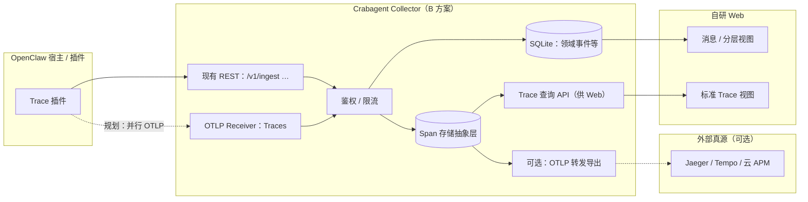

# OpenTelemetry + OTLP 集成方案 — 设计文档

**状态**：规划定稿（无实现代码）  
**版本**：0.1  
**关联**：[技术文档](./opentelemetry-otlp-technical.md) · [架构与数据流](./architecture.md)

---

## 1. 背景与目标

Crabagent 当前以 **领域事件**（`message_received`、`llm_*`、工具钩子等）为核心，经插件信封写入 Collector（SQLite），自研 Web 做消息列表、详情与分层观测。

本设计在**不改变产品主线语义**的前提下，引入 **OpenTelemetry Traces** 与 **OTLP** 接收能力，使：

1. **链路上报**符合行业通用模型（Trace / Span），便于对接 Jaeger、Grafana Tempo、云 APM 等后端。
2. **Collector 采用 B 方案**：在 Crabagent Collector 侧增加 **OTLP 摄入**，统一收口标准链路数据。
3. **自研 UI** 能够绘制 **标准 Trace 视图**（树状 Span、耗时、父子关系），与现有「消息 / msg_id / 分层」视图并存或融合展示。
4. **SQLite 不作为唯一真源**：标准 Trace 数据以 **OTLP 可转发、可落多副本** 为目标；本地 SQLite 保留为 **产品事件缓存 / 降级 / 审计** 用途之一，而非全局单一事实来源。

---

## 2. 设计原则

| 原则 | 说明 |
|------|------|
| **标准优先** | Trace 语义对齐 OTEL；对外导出优先 **OTLP**（gRPC 或 HTTP/protobuf）。 |
| **与现有事件对齐** | 每条领域事件仍可映射到 **一个 Span**（中档粒度），便于对照与排错。 |
| **ID 可关联** | `trace_root_id`、`msg_id`、`event_id`、`run_id` 等以 **Span attribute** 或独立列保留，支持跨 UI、跨系统关联。 |
| **多真源可接受** | 允许 **Collector 内存储** + **外部 Trace 后端** 同时存在；产品需明确「主读路径」与「降级路径」。 |
| **隐私与体量** | Prompt、正文等敏感内容默认 **不进 Span attribute** 或强脱敏；配合采样与保留策略。 |

---

## 3. 已定决策摘要

### 3.1 Span 粒度：中档

- **每个现有 hook 类型对应一个 Span**（与当前 `type` 大致 1:1）。
- 父子关系由 **OTEL 上下文传播** 与 **显式 parent** 在 ingest 侧补全（详见技术文档）。
- 不在首阶段把 LLM 流式 token、工具内部细分为独立 Span（避免体量爆炸）。

### 3.2 架构方案：B（Collector 侧 OTLP）

- **Crabagent Collector** 增加 **OTLP/Traces** 接收端点（gRPC 与/或 HTTP）。
- **插件或宿主**既可继续发送现有 JSON 批量 ingest，也可 **并行发送 OTLP**（实现阶段再定双写策略）；规划上 **以 Collector 为 OTLP 统一入口** 为推荐形态，便于鉴权、限流与二次导出。
- **自研 UI** 通过 **Collector 提供的「Trace 查询 API」**（由内部 Span 存储或代理外部后端）拉取 **标准 Trace 结构** 渲染，而非仅解析 `payload_json` 拼树。

### 3.3 数据真源

- **SQLite（events 等）**：继续服务现有产品能力；**不**承诺作为全局唯一真源。
- **Span 存储**：规划为 **独立逻辑模型**（可落在 SQLite 新表、或外部 Tempo/Jaeger，或二者兼有）；**标准 Trace 的权威展示**以 **Span 模型 + trace_id** 为准。
- **对外**：可通过 Collector **转发 OTLP** 到组织标准后端，实现「Crabagent 非唯一真源」的运维模型。

---

## 4. 用户与场景

| 角色 | 场景 |
|------|------|
| 开发者 / 运维 | 在自研 UI 中打开某条消息或某次会话，切换到 **标准 Trace** 视图，查看 Span 树与耗时。 |
| 开发者 / 运维 | 同一链路在 **Jaeger/Tempo** 中打开，与 Crabagent UI 中 **trace_id** 一致。 |
| 平台 | 通过 OTEL Collector 或云厂商 ingest **统一采集** OpenClaw 网关多实例。 |
| 产品 | 保留现有 **msg_id、五层观测、DB 查询** 等能力；标准 Trace 为 **增强型观测**，非替代全部文案与交互。 |

---

## 5. 系统架构（逻辑）

说明：**实线**为当前或目标主路径；**虚线**为规划中的并行 OTLP 与转发。

---

## 6. 自研 UI：标准 Trace 与现有视图的关系

| 维度 | 现有 UI | 标准 Trace UI（规划） |
|------|---------|------------------------|
| 数据基础 | `events` 行 + `payload` | **Span 列表 / 树**（`trace_id`、父子、`start/end`） |
| 导航入口 | 消息列表、`thread_key`、`msg_id` | 从同一会话/消息 **跳转**，携带 `trace_id` 或 `span_id` |
| 语义 | 领域事件类型、Crabagent 分层 | OTEL Span 名、attributes、status |
| 关联 | `msg_id`、`run_id` | 同上，以 **attribute** 展示并可筛选 |

**产品决策建议**：标准 Trace 作为详情页 **Tab 或二级页**，与「时间线树」并存；长期可做 **双向高亮**（点击 Span ↔ 对应领域事件）。

---

## 7. 非目标（本阶段明确不做）

- 不在本文档中规定具体代码路径与依赖版本号（见技术文档中的「实现占位」即可）。
- 首阶段不要求 **Metrics / Logs** 全量 OTLP（可后续扩展）。
- 不要求 **完全下线** 现有 JSON ingest 或 **仅** 依赖外部后端才能打开 Web（降级需仍能使用 SQLite 事件视图）。

---

## 8. 风险与缓解

| 风险 | 缓解 |
|------|------|
| 上下文断裂导致 Span 树分叉 | 技术文档规定 **inject/extract** 点与 envelope 字段；联调用固定场景验收。 |
| 双写重复或 id 冲突 | **trace_id / span_id** 生成策略单一真源；ingest 幂等与去重策略在技术文档中定义。 |
| SQLite 与外部后端不一致 | 明确 **展示优先级**（例如：Trace 页优先读 Span 存储；外部为归档）；文档化运维流程。 |
| 敏感数据泄露 | Span attribute 白名单；与现有 truncate / omit 策略对齐。 |

---

## 9. 里程碑建议（设计后续）

1. **M0**：评审本文档 + 技术文档，冻结 trace_id 与 `trace_root_id` 映射策略。  
2. **M1**：Collector OTLP 接收 + Span 落库（或最小内存）+ 一条端到端链路。  
3. **M2**：Web 标准 Trace 只读页 + 与 `msg_id` 跳转。  
4. **M3**：OTLP 转发、采样、生产配置与运维手册。

---

## 10. 术语

| 术语 | 说明 |
|------|------|
| **Trace** | 一次分布式追踪的根；含多个 Span。 |
| **Span** | 一段有起止时间的操作单元；中档粒度下约等于一个 hook 事件。 |
| **OTLP** | OpenTelemetry Protocol，用于导出 Traces（及 Metrics/Logs）。 |
| **B 方案** | Collector 集成 OTLP Receiver，统一摄入标准链路数据。 |
| **非唯一真源** | SQLite 与外部 Trace 后端均可持有数据；产品需定义主读路径与降级。 |

---

## 11. 修订记录

| 版本 | 日期 | 说明 |
|------|------|------|
| 0.1 | 规划 | 初稿：中档 Span、B 方案、多真源、自研标准 Trace UI。 |
