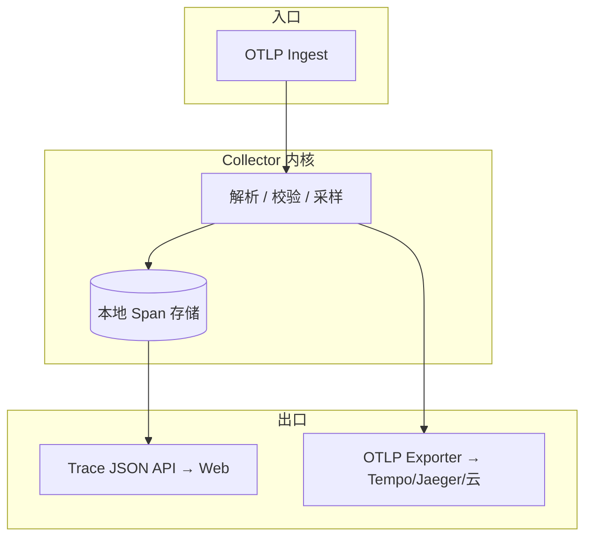

# OpenTelemetry + OTLP 集成方案 — 技术文档

**状态**：规划定稿（无实现代码）  
**版本**：0.1  
**关联**：[设计文档](./opentelemetry-otlp-design.md) · [技术设计总览](./TECHNICAL_DESIGN.md) · [架构与数据流](./architecture.md)

---

## 1. 范围

本文档描述 **B 方案**下 Collector 的 **OTLP 接入**、**Span 数据模型**、**与现有 `events` 的关系**、**供自研 UI 使用的查询形态**，以及 **OpenTelemetry 上下文传播** 的技术约束。

**不包含**：具体 npm 包版本、PR 级代码改动清单（实现阶段另起任务）。

---

## 2. OTLP 接入（Collector）

### 2.1 协议与端点（建议）

| 传输 | 用途 | 备注 |
|------|------|------|
| **OTLP/gRPC** | 生产默认 | 端口与路径遵循 OTEL 惯例（如 `4317`）。 |
| **OTLP/HTTP protobuf** | 防火墙友好 | 路径如 `/v1/traces`。 |
| OTLP/HTTP JSON | 仅调试 | 体量与性能较弱，可不对外暴露。 |

### 2.2 鉴权

- 与现有 REST **对齐**：`Authorization: Bearer` / `X-API-Key` / 查询参数 token（以当前 Collector 行为为准）。
- **gRPC**：使用 **metadata** 传递同等 token；需在技术实现时定义 metadata 键名并写进运维文档。

### 2.3 限流与体控

- 按 **源 IP / API Key / service.instance.id** 可配置 QPS 与单请求 Span 数上限。
- **拒绝策略**：超限返回 OTEL 约定错误码，避免静默丢数据无感知（或显式 `partial_success`）。

---

## 3. Span 模型（中档粒度）

### 3.1 与 hook 的映射

每个 **OpenClaw 钩子触发一次上报** → **一个 Span**（在成功采样的前提下）。

| 概念 | 技术字段 |
|------|----------|
| Span 名称 | 建议 `crabagent.{type}` 或直接使用 `type` 字符串（需稳定枚举）。 |
| 起止时间 | `start_time_unix_nano` / `end_time_unix_nano`；若钩子仅有「点事件」，结束时间 = 开始时间 + 最小时长或省略 end 由 SDK 填同刻。 |
| Kind | 默认 `INTERNAL`；若未来区分入站用户消息可为 `SERVER`（实现阶段再定）。 |
| Status | 工具错误、LLM 失败等映射 `ERROR` + `description` 摘要（无栈时可省略）。 |

### 3.2 资源（Resource）建议属性

| Key | 说明 |
|-----|------|
| `service.name` | 如 `openclaw-crabagent-plugin` 或宿主名。 |
| `service.instance.id` | 实例标识，便于多网关。 |
| `deployment.environment` | `dev` / `staging` / `prod`。 |

### 3.3 Span 属性（与现有 ID 对齐）

以下建议使用统一前缀 **`crabagent.*`**（或 `io.crabagent.*`，实现时二选一写死）：

| Attribute | 类型 | 说明 |
|-----------|------|------|
| `crabagent.event_id` | string | 与现有信封 `event_id` 一致时便于关联 `events` 表。 |
| `crabagent.trace_root_id` | string | 现有内部根 id；与 W3C `trace_id` 映射关系见 §4。 |
| `crabagent.msg_id` | string | 用户回合关联。 |
| `crabagent.run_id` | string | OpenClaw run。 |
| `crabagent.session_id` | string | 可选。 |
| `crabagent.session_key` | string | 可选；注意长度与隐私。 |
| `crabagent.hook_type` | string | 与 `type` 冗余一份便于检索。 |

**禁止或需脱敏**：原始 prompt、用户消息全文、token 明细等 — 与当前插件 truncate 策略一致，**默认不进 attribute** 或进哈希/长度摘要字段。

### 3.4 Span 事件（可选）

首阶段可不用 **Span Events**；若需与「分层观测」对齐，可将 **Crabagent 五层** 摘要以 **单个 event** 或 **json 属性** 附加在对应 Span 上（注意大小限制）。

---

## 4. TraceId / SpanId 与 `trace_root_id` 映射

### 4.1 OTEL 惯例

- **trace_id**：16 字节，OTLP 中通常为 **32 个十六进制字符**。  
- **span_id**：8 字节，16 hex。  
- **parent_span_id**：可选，根 Span 为空。

### 4.2 推荐策略（实现前须评审定一种）

**策略 A（推荐）**：新生成的 OTEL `trace_id` 与现有 **`trace_root_id` 解耦**；每条 Span 上带 attribute `crabagent.trace_root_id`。  
- 优点：完全符合 OTEL 十六进制 trace_id，与 Jaeger/Tempo 无歧义。  
- 缺点：用户需在 UI 同时理解两个 id，或通过 UI 只展示 `trace_id`。

**策略 B**：将现有 **`trace_root_id`（UUID）** 规范化后 **嵌入** 为 trace_id（例如 UUID 去横杠 32 字符，需验证与各后端兼容性）。  
- 优点：一条 id 贯穿旧库与新 Trace。  
- 缺点：与严格 OTEL 随机 trace_id 工具链混用时可能被误判格式。

**策略 C**：以 **`trace_root_id` 为 span attribute**，**trace_id** 由 OTLP 入口统一生成 **子 trace** 与外部系统同步 — 复杂度高，首阶段不推荐。

**本文档建议默认采用策略 A**，在 UI 通过 `crabagent.trace_root_id` 与旧事件列表 **跳转关联**。

---

## 5. 上下文传播（父子 Span）

### 5.1 目标

同一用户回合内：`message_received` → `before_*` → `llm_input` → 工具 → `llm_output` … 形成 **单根 Trace** 下的 **Span 树**。

### 5.2 机制

- **进程内**：使用 OTEL **Context** + `startActiveSpan`（或等价）保持当前 `span_id` 为 **父**。  
- **跨异步边界**（`setImmediate`、队列、子进程）：在 **自定义 envelope** 或 **W3C traceparent** 中序列化 `trace_flags` + `trace_id` + `parent_span_id`，在下一跳 **extract** 后作为 parent 创建子 Span。  
- **插件 → Collector**：OTLP 请求内每个 **Span** 自带 `trace_id` / `span_id` / `parent_span_id`；Collector **信任**合法字段并持久化，**不**随意改写父子（除非做修复模式）。

### 5.3 与 `run_id` 的关系

- 同一 `run_id` 下多个 Span 应共享 **同一 trace_id**（除非明确设计「子 trace」）。  
- 可在 **第一个带 `run_id` 的 Span** 上建立 **自定义 link**（OTEL Links）指向 `message_received` Span（实现阶段可选）。

---

## 6. 存储抽象层（Span 存储）

### 6.1 职责

- 接收 OTLP **ExportTraceServiceRequest**，解析 **ResourceSpans / ScopeSpans / Spans**。  
- 支持 **按 trace_id 查询** 全量 Span（排序规则：`start_time`）。  
- 可选：支持 **按 `crabagent.msg_id` / `crabagent.trace_root_id` 反查 trace_id**（需二级索引或扫描策略）。

### 6.2 实现选项（并列，可多选）

| 方案 | 说明 |
|------|------|
| **SQLite 新表** | `spans` 或规范化多表；适合单机与现有部署；非全局唯一真源时仍可作为 **本地副本**。 |
| **仅内存 + 转发** | Collector 不写 Span 落盘，只转发 OTLP 到 Tempo；**自研 UI 需读外部后端 API**（复杂度高）。 |
| **混合** | 本地 SQLite 保留近期 Span；异步导出 OTLP 到 **外部真源**；UI 默认读本地，可配置读外部。 |

**与设计文档一致**：SQLite **不是**唯一真源时，推荐 **混合** 或 **UI 可配置后端**，并在运维文档写明 **主读路径**。

---

## 7. 供自研 UI 的 API（建议形态）

以下 REST 形状为 **规划建议**，实现时可微调路径：

| 方法 | 路径 | 说明 |
|------|------|------|
| `GET` | `/v1/traces/otel/{traceId}` | 返回 **标准 JSON**：`trace_id`、扁平 `spans[]`（含 `parent_span_id`、`attributes` map、起止时间）。 |
| `GET` | `/v1/traces/otel/by-msg-id?msg_id=` | 解析索引得到 `trace_id` 再返回同上（或 302 到上一路径）。 |
| `GET` | `/v1/traces/otel/by-trace-root?trace_root_id=` | 同上，依赖 attribute 索引。 |

**响应格式**：建议贴近 **Jaeger JSON** 或内部 **稳定 schema**（版本字段 `schema_version`），便于前端一次解析画树。

**SSE**：可选 `trace_id` 维度的 **实时 Span 追加**（实现难度大，可二期）。

---

## 8. 与 `events` 表的关系

| 维度 | `events`（现有） | Span 存储（新） |
|------|------------------|----------------|
| 行语义 | 领域事件一行 | OTEL Span 一行（或规范化） |
| 主键 | `id` / `event_id` | `span_id` + `trace_id` |
| 查询 | thread、type、msg_id 等 | trace_id、parent、时间 |
| 关联 | `crabagent.event_id` on Span | `events` 可增 `otel_trace_id`（可选，实现阶段定） |

**双写**：同一 hook 可同时产生 **REST ingest 行** 与 **OTLP Span**；通过 **`crabagent.event_id`** 保证可 Join。

---

## 9. 转发与多真源（非唯一真源）

- **转发**可使用 **官方 OpenTelemetry Collector** 作为 sidecar，或由 Crabagent **内嵌轻量 exporter**（实现选型另议）。  
- **冲突解决**：以外部后端为 **长期归档真源** 时，本地仅保留 **TTL**（例如 7 天）。

---

## 10. 采样

| 类型 | 说明 |
|------|------|
| **头部采样** | 在插件或 Collector 入口按概率丢弃整个 Trace。 |
| **尾部采样** | 需缓冲，首阶段可不做。 |
| **强制保留** | 对带特定 `msg_id` / 错误 Status 的 Trace AlwaysOn（规则配置化）。 |

采样决策应写入 **Span attribute**（如 `crabagent.sampled`）便于审计。

---

## 11. 安全

- TLS：生产 OTLP **必须** TLS（或内网 mTLS）。  
- Token：与现有 API Key 体系一致；**按租户隔离** trace_id 查询（若未来多租户）。  
- **属性白名单**：防止插件把任意大 JSON 塞进 attribute。

---

## 12. 测试与验收（实现阶段清单）

1. 单进程：一用户消息 → 连续钩子 → **一个 trace_id**，Span 树深度 ≥ 3。  
2. `crabagent.msg_id` 在同一 trace 的多个 Span 上 **一致**（或根 Span 带、子 Span 继承策略明确）。  
3. UI：给定 `trace_id` 渲染与 Jaeger **同结构**对比（允许展示字段子集）。  
4. 转发：外部后端可检索到 **相同 trace_id**（若采用策略 A，则对比 attribute 中的 `trace_root_id`）。

---

## 13. 依赖与仓库边界（提示）

| 组件 | 规划职责 |
|------|----------|
| `packages/openclaw-trace-plugin` | 产生 Span（或 OTLP 客户端）；注入/提取上下文。 |
| `services/collector` | OTLP Receiver、Span 存储、Trace JSON API、可选 Exporter。 |
| `apps/web` | 标准 Trace 树组件、路由、与 `msg_id` 联动。 |

---

## 14. 修订记录

| 版本 | 日期 | 说明 |
|------|------|------|
| 0.1 | 规划 | 初稿：B 方案、中档 Span、存储抽象、API 草图、trace_id 策略 A 为默认建议。 |
