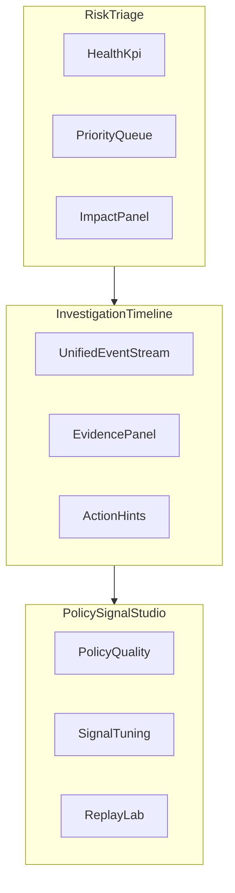
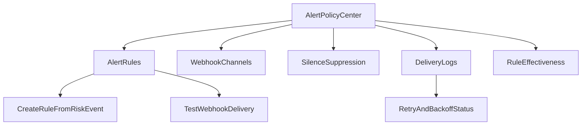

# 审计与安全导航重构设计草案（V1）

本文档替代 V0.1 的“资源页/命令页增强”思路，采用全新方案：  
不再以技术数据表划分页面，而是以调查与处置流程组织产品。

## 1. 核心决策

- 一级菜单保持不变：`观测` / `审计` / `安全` / `设置`。
- 二级导航重构为：`审计` 下的“风险中心/调查中心”，`安全` 下的“告警与策略”。
- 原 `resource-audit` 与 `command-analysis` 降级为二级明细视图，不再承载主决策入口。
- 若当前展示项不能驱动决策，直接删除或默认隐藏。

## 2. 目标与验收

### 2.1 目标

- 5 秒内判断是否有高优先级风险。
- 30 秒内定位“先处理什么”与“影响范围”。
- 3 步内从告警项钻取到证据并做处置判断。

### 2.2 验收指标

- `agent_resource_access` 新增数据中 `tool://*` 占比 `0%`。
- 高优先级事件（P0/P1）平均定位时间下降 30%+。
- 首页风险队列点击后，95% 场景可直接进入可解释证据面板（无需跨页搜索）。

## 3. 新产品架构



## 4. 页面设计（重构后）

## 4.1 风险中心（Risk Triage，新主入口）

目标：风险发现与优先级决策。

模块：
- `Health KPI`：总事件、P0/P1 数量、失败率、风险趋势。
- `Priority Queue`：跨资源/命令统一风险队列（默认按 severity 排序）。
- `Impact Panel`：受影响 agent/channel/workspace 排名。
- `One-click Drilldown`：进入调查时间线（trace/thread 维度）。

默认不展示大而全图表，仅保留对决策有价值的 3-4 个模块。

## 4.2 调查中心（Investigation Timeline，核心工作页）

目标：一次调查里串联“命令执行、资源访问、策略命中、错误上下文”。

模块：
- 统一时间线（span 事件流）
- 事件卡片（CommandEvent / ResourceEvent / PolicyHitEvent / SystemAnomalyEvent）
- 证据面板（输入摘要、输出摘要、命中规则、关联上下文）
- 操作建议（隔离、降权、加规则、忽略）

替代当前“先看资源页再跳命令页”的分裂操作路径。

## 4.3 告警与策略中心（Policy & Signal Studio，治理页）

目标：控制告警质量，降低噪声。

模块：
- 规则命中质量（误报、漏报、命中分布）
- 信号开关（启发式/强规则）
- 告警路由与通知
- 历史回放（规则变更前后对比）

## 4.4 数据探索（Data Explorer，高级模式，可选）

面向专家做 ad-hoc 查询，默认不在主导航展示。

## 5. 数据模型重构（前端视角）

## 5.1 统一事件模型

以“可调查事件”为核心，不以后端表结构直接驱动 UI：

- `event_type`: `command` | `resource` | `policy_hit` | `system_anomaly`
- `severity`: `P0` | `P1` | `P2` | `P3`
- `event_time`
- `subject`（一句话摘要）
- `why_flagged`（命中原因）
- `impact_scope`（agent/channel/workspace）
- `trace_id` / `thread_key` / `span_id`

## 5.2 风险评分建议

- `P0`：敏感路径 + enforce 命中；高危命令失败（system/network）。
- `P1`：高 token 风险；重复资源访问异常；权限异常。
- `P2`：单次异常、低影响可恢复问题。
- `P3`：观察类命中（audit_only）且无复合风险。

## 6. 删除与保留策略（明确）

## 6.1 建议删除（主界面）

- 不能直接驱动处置的重复趋势图（多口径同类图）。
- 默认表格中的 `span_id`、`trace_id`（保留在详情/复制，不占主列）。
- `tool://*` 资源类展示项（从数据源层面消除）。
- 复杂筛选器默认展开（改为“基础筛选 + 高级抽屉”）。

## 6.2 建议保留但下沉

- `by_workspace`、`daily_io`、`top_tools` 等运营类图表下沉到高级/运营视图。
- 原始 JSON 全量内容下沉到证据面板。

## 7. P1 数据口径修复方案（资源 URI 边界）

## 7.1 业务规则

`resource_uri` 必须是“真实资源标识”，否则该 span 不进入 `agent_resource_access`。

允许样例：
- `https://...`
- `file:///...`
- `/var/log/...`、`./foo/bar.txt`、`C:\Users\...`
- 白名单协议（待确认）：`memory://...`

拒绝样例：
- `tool://bash`
- `tool://read_file`
- `unknown`、`none`、空值

## 7.2 写入行为

- 无效 URI：`DELETE` 已存在同 `span_id` 行并停止写入。
- 有效 URI：正常 upsert。
- 同时保证 ingest/resync/backfill 走同一判定逻辑，口径一致。

## 8. 迁移方案（旧页面到新架构）

## 8.1 导航迁移

- 新增一级：`风险中心（Risk Triage）`、`调查中心（Investigation Timeline）`、`告警与策略中心（Policy & Signal Studio）`
- 旧页：`Resource Audit`、`Command Analysis` 迁为二级“详情视图”

## 8.2 功能迁移映射

- 资源与命令列表能力 -> `调查中心（Investigation Timeline）` 事件明细
- 资源/命令统计 -> `风险中心（Risk Triage）` 的摘要卡片与影响面模块
- 策略命中分析 -> `告警与策略中心（Policy & Signal Studio）`

## 9. 分阶段落地

### P0（主流程优先）
- 优先上线 `风险中心（Risk Triage）` 与 `调查中心（Investigation Timeline）`。
- 审计导航优先完成“高级（折叠）”分组：
  - `资源访问明细（Legacy）`
  - `命令执行明细（Legacy）`
  - `数据探索（Data Explorer，可选）`
- 完成“风险中心 -> 调查中心 -> 高级（折叠）”的可达路径与基础交互闭环。

### P1（数据正确性）
- 实施 `resource_uri` 有效性校验与 `tool://` 清理。
- 增加回归用例覆盖 ingest/resync/backfill。

### P2（治理闭环）
- 上线 `告警与策略中心（Policy & Signal Studio）`。
- 告警质量反馈闭环（误报/漏报）。

## 10. PM 验收清单

### 数据验收
- 新写入资源事件中无 `tool://*`。
- 非资源 span 不出现在资源事件视图。

### 体验验收
- 首页能直接看出“今天先处理什么”。
- 任意高风险项可在 3 步内进入证据页并形成处置建议。

### 治理验收
- 可区分“策略命中”与“启发式风险”并独立调参。
- 规则变更可通过回放验证收益与副作用。

## 11. 与告警模块联合实现方案

目标：将“设置告警”从孤立配置页改为风险处置闭环的一部分，做到从发现问题到配置规则一跳可达。

### 11.1 联合后的导航结构（保持现有一级菜单）

- 一级菜单保持不变：`观测` / `审计` / `安全` / `设置`
- 二级聚合映射如下：
  - `审计`
    - 风险中心
      - 风险分诊（默认）
      - 风险优先队列
      - 影响面分析
    - 调查中心
      - 调查时间线
      - 证据面板
      - 处置建议记录（可选）
    - 高级（折叠）
      - 资源访问明细（Legacy）
      - 命令执行明细（Legacy）
      - 数据探索（Data Explorer，可选）
  - `安全`
    - 告警与策略中心（Alert & Policy Center）
      - 告警规则（Alert Rules）
      - 通知渠道（Notification Channels）
      - 抑制与静默（Silence / Suppression）
      - 信号调优（Signal Tuning）
      - 回放验证（Replay Lab）
  - `设置`
    - 保留系统配置，不承载告警核心运营入口

### 11.2 关键联动动作

- 在风险分诊卡片提供：
  - 一键“创建告警规则”
  - 一键“加入静默策略”
  - 一键“调整信号灵敏度”
- 在调查时间线提供：
  - 一键“将当前事件转为规则样本”
  - 一键“标记误报并提交抑制建议”
- 在告警与策略中心反向展示：
  - 规则近 24h 命中效果
  - 误报反馈率
  - 通知渠道失败率与失败事件

### 11.3 交付边界

- 第一阶段优先交付审计主流程重构：
  - 风险中心
  - 调查中心
  - 高级（折叠）分组与旧页迁移入口
- 第二阶段打通“风险卡片 -> 规则创建/静默创建”。
- 第三阶段补“回放验证 + 误报反馈闭环”，并评估策略建议自动化（可选）。

## 12. 可落地菜单配置草案

以下配置可直接用于前端菜单系统（TS/JSON）。

```ts
type MenuItem = {
  id: string;
  titleKey: string;
  path?: string;
  icon?: string;
  order: number;
  permission?: string;
  featureFlag?: string;
  badge?: {
    type: "count" | "dot";
    source: string;
    threshold?: number;
  };
  children?: MenuItem[];
};

export const auditSecurityNavMenu: MenuItem[] = [
  {
    id: "audit-risk-center",
    titleKey: "nav.auditRiskCenter",
    icon: "shield-alert",
    order: 10,
    permission: "audit.view",
    children: [
      {
        id: "risk-triage",
        titleKey: "nav.riskTriage",
        path: "/risk-triage",
        order: 11,
        permission: "audit.view",
        badge: { type: "count", source: "risk.p0p1.count", threshold: 0 },
      },
      {
        id: "risk-priority-queue",
        titleKey: "nav.riskPriorityQueue",
        path: "/risk-priority",
        order: 12,
        permission: "audit.view",
      },
      {
        id: "risk-impact",
        titleKey: "nav.riskImpact",
        path: "/risk-impact",
        order: 13,
        permission: "audit.view",
      },
    ],
  },
  {
    id: "audit-investigation-center",
    titleKey: "nav.auditInvestigationCenter",
    icon: "timeline",
    order: 20,
    permission: "audit.view",
    children: [
      {
        id: "investigation-timeline",
        titleKey: "nav.investigationTimeline",
        path: "/investigation",
        order: 21,
        permission: "audit.view",
      },
      {
        id: "investigation-evidence",
        titleKey: "nav.investigationEvidence",
        path: "/investigation/evidence",
        order: 22,
        permission: "audit.view",
      },
    ],
  },
  {
    id: "security-alert-policy-center",
    titleKey: "nav.securityAlertPolicyCenter",
    icon: "bell-cog",
    order: 30,
    permission: "alert.manage",
    children: [
      {
        id: "alert-rules",
        titleKey: "nav.alertRules",
        path: "/alerts/rules",
        order: 31,
        permission: "alert.manage",
      },
      {
        id: "alert-channels",
        titleKey: "nav.alertChannels",
        path: "/alerts/channels",
        order: 32,
        permission: "alert.manage",
      },
      {
        id: "alert-silence",
        titleKey: "nav.alertSilence",
        path: "/alerts/silence",
        order: 33,
        permission: "alert.manage",
      },
      {
        id: "signal-tuning",
        titleKey: "nav.signalTuning",
        path: "/alerts/signal-tuning",
        order: 34,
        permission: "policy.manage",
      },
      {
        id: "replay-lab",
        titleKey: "nav.replayLab",
        path: "/alerts/replay-lab",
        order: 35,
        permission: "policy.manage",
        featureFlag: "replay_lab_v1",
      },
    ],
  },
  {
    id: "audit-advanced-analysis",
    titleKey: "nav.auditAdvancedAnalysis",
    icon: "flask",
    order: 90,
    permission: "audit.advanced",
    children: [
      {
        id: "resource-audit-legacy",
        titleKey: "nav.resourceAuditLegacy",
        path: "/resource-audit",
        order: 91,
        permission: "audit.advanced",
      },
      {
        id: "command-analysis-legacy",
        titleKey: "nav.commandAnalysisLegacy",
        path: "/command-analysis",
        order: 92,
        permission: "audit.advanced",
      },
    ],
  },
];
```

### 12.1 路由建议

- `/risk-triage`
- `/risk-priority`
- `/risk-impact`
- `/investigation`
- `/investigation/evidence`
- `/alerts/rules`
- `/alerts/channels`
- `/alerts/silence`
- `/alerts/signal-tuning`
- `/alerts/replay-lab`（feature flag 控制）

### 12.2 权限建议

- `audit.view`
- `alert.manage`
- `policy.manage`
- `audit.advanced`

### 12.3 Badge 与默认落地页

- 默认首页：`审计 > 风险中心 > /risk-triage`
- `risk-triage` badge：`risk.p0p1.count`
- `安全 > 告警与策略` dot：`alerts.delivery.failed.count > 0`

### 12.4 一级菜单映射说明（固定）

- `观测`：保持现有观测能力，不承载本次新增核心入口。
- `审计`：承载风险中心、调查中心与高级分析。
- `安全`：承载告警与策略中心。
- `设置`：保留系统配置，不再承载告警主入口。

## 13. 研发任务拆解（菜单与告警联动）

### 13.1 前端任务

- 菜单配置重构：按 `auditSecurityNavMenu` 接入导航渲染。
- 新增一级页面壳：`risk-triage`（风险中心）、`investigation`（调查中心）、`alert-policy-center`（告警与策略中心）。
- 旧页面迁移到 `advanced-analysis` 折叠分组。
- badge 数据源接入（P0/P1 计数、通知失败计数）。
- 从风险卡片和调查事件触发“创建规则/静默”快捷动作。

### 13.2 后端任务

- 提供菜单 badge 统计接口（或复用现有 summary 接口聚合）。
- 提供“从事件创建规则/静默”的轻量接口。
- 提供告警渠道健康状态统计（失败率、近 24h 失败数）。

### 13.3 验收用例

- 高风险事件出现时，左侧菜单实时显示计数。
- 任意事件可在 3 步内完成“创建规则或静默”。
- 无权限用户不可见 `告警与策略` 与 `高级分析`。
- feature flag 关闭时不显示 `Replay Lab`。

## 14. Jira 模板化拆分（可直接建单）

## 14.1 Epic 列表

### EPIC-1：审计与安全二级导航重构

目标：在不改变一级菜单（观测/审计/安全/设置）的前提下，完成审计与安全下的二级导航聚合重构。

### EPIC-2：资源 URI 边界修复与数据口径统一

目标：确保 `agent_resource_access.resource_uri` 仅保留真实资源标识，移除 `tool://` 占位污染。

### EPIC-3：告警与策略中心联动闭环

目标：从风险事件一键创建规则/静默，并可追踪规则效果与通知健康。

## 14.2 Story 模板

每个 Story 建议使用以下模板：

- **标题**：`[模块] [能力] [结果]`
- **业务价值**：一句话说明减少什么成本/风险
- **范围**：包含/不包含
- **依赖**：前置 API、权限、feature flag
- **验收标准（AC）**：Given/When/Then
- **埋点**：行为埋点、性能埋点、错误埋点

## 14.3 Story 拆分建议

### STORY-1：左侧菜单重构上线

- 范围：
  - 审计下新增“风险中心/调查中心”，安全下新增“告警与策略”
  - 旧资源/命令页迁移至审计下“高级分析”
- AC：
  - 给定普通用户登录，看到新导航但不看到高级分析（无权限）
  - 给定管理员登录，看到完整导航与告警中心
  - 当 feature flag 关闭时，`Replay Lab` 不显示

### STORY-2：风险分诊首页上线（MVP）

- 范围：
  - KPI 卡片、优先队列、影响面模块
- AC：
  - 能展示 P0/P1 数量
  - 点击队列项可进入调查时间线并带过滤条件

### STORY-3：调查时间线与证据面板

- 范围：
  - 统一事件流 + 证据面板 + 快捷处置入口
- AC：
  - 任意风险事件 3 步内可进入证据详情
  - 可从证据面板一键发起“创建规则/静默”

### STORY-4：resource_uri 边界修复

- 范围：
  - 有效 URI 判定统一函数
  - ingest/resync/backfill 口径统一
- AC：
  - 新数据中无 `tool://*`
  - 非资源型 span 不写入 `agent_resource_access`
  - 回归通过现有主要路径

### STORY-5：告警规则联动创建

- 范围：
  - 从风险卡片/事件快速生成规则草稿
  - 规则创建后可回跳到来源事件
- AC：
  - 规则草稿自动带入事件上下文（agent/channel/event_type）
  - 创建成功后可查看生效状态

### STORY-6：静默/抑制联动

- 范围：
  - 事件级一键静默，支持时长与作用域
- AC：
  - 静默期间同类事件不再推送告警
  - 静默到期自动恢复

## 14.4 Task 粒度建议（样例）

按当前优先级（先风险中心/调查中心/高级折叠）建议执行顺序：

- FE-Task-1：菜单配置接入与路由守卫
- FE-Task-2：风险分诊页面骨架与状态管理
- FE-Task-3：调查时间线组件与证据面板
- FE-Task-3.1：高级（折叠）分组与 Legacy 页迁移入口
- FE-Task-4：规则/静默快捷操作 UI
- BE-Task-1：风险统计与 badge 接口
- BE-Task-2：事件 -> 规则草稿接口
- BE-Task-3：事件 -> 静默策略接口
- BE-Task-4：resource_uri 有效性校验与写入策略修复
- QA-Task-1：权限矩阵回归
- QA-Task-2：数据口径与旧页面一致性对账

## 15. 里程碑与排期建议

## 15.1 里程碑

- **M1（第 1 周）**：菜单重构 + 审计导航重排（风险中心/调查中心/高级折叠）+ 权限可见性
- **M2（第 2-3 周）**：风险分诊 + 调查时间线 MVP + 旧资源/命令页迁移到高级折叠
- **M3（第 4 周）**：`resource_uri` 口径修复（含 ingest/resync/backfill 回归）+ 告警联动（规则/静默）
- **M4（第 5 周）**：体验优化、埋点、灰度回收

## 15.2 发布策略

- 第一阶段灰度：仅对管理员与安全角色开放新审计主流程（风险中心/调查中心/高级折叠）
- 第二阶段灰度：按 workspace 白名单开放，并同步上线数据口径修复与告警联动
- 第三阶段全量：保留旧入口 1 个版本周期后下线

## 16. 风险与应对

### 风险 1：旧页面依赖路径过多，迁移后找不到功能

- 应对：
  - 在旧入口保留“迁移指引”
  - 每个新页面放“原功能映射”提示

### 风险 2：P0/P1 口径争议导致队列可信度不足

- 应对：
  - 在文档固定风险分级规则
  - 提供“为什么排这个优先级”的解释字段

### 风险 3：告警联动初期误报高，用户反感

- 应对：
  - 先开观察模式 + 静默策略
  - 回放验证后再扩大自动化范围

## 17. 评审清单（会前准备）

- 产品：确认导航与页面职责边界
- 前端：确认菜单配置、路由、权限与组件复用
- 后端：确认接口契约、统计口径、联动接口
- QA：确认验收场景与回归范围
- 运维/安全：确认告警通知策略与值班流程

## 18. 告警页面重构（V1）

目标：将现有告警页从“本地规则管理 + 模板展示”升级为“可运营的告警中心”，与风险分诊和调查时间线形成闭环。

### 18.1 重构原则

- 告警页不再是独立配置孤岛，必须与风险事件联动。
- 第一版仅支持 Webhook URL 投递，统一渠道模型。
- 去除与当前方向不一致的能力：Agent 离线告警、Slack 专属类型。
- 规则配置以“可解释 + 可治理”优先，默认支持静默、去重、冷却。

### 18.2 页面定位与导航

- 新位置：一级菜单 `安全` 下的核心子页（分组名：`告警与策略`）。
- 页面结构建议：
  - `告警规则`（Rules）
  - `通知渠道`（Webhook Channels）
  - `静默与抑制`（Silence / Suppression）
  - `投递历史`（Delivery Logs）
  - `规则效果`（Rule Effectiveness，可选）

### 18.3 页面信息架构



### 18.4 与现有能力的取舍

#### 直接下线或移除

- `Agent Offline` 预置规则模板
- `Slack` 专属 webhook 类型与文案分支
- `email` 投递类型（V1 不支持）

#### 保留并重构

- 阈值规则能力（operator/threshold/window）
- 测试通知能力（改为统一 webhook 测试）
- 告警历史（升级为投递历史 + 状态机）

### 18.5 V1 规则目录（仅 webhook）

按优先级建议首发：

#### P0（立即通知）

- `SEC_ENFORCE_HIT`：策略强拦截命中（`intercepted=1`）
- `RESOURCE_SENSITIVE_PATH`：敏感路径访问
- `RESOURCE_SECRET_CREDENTIAL_HINT`：密钥/凭据类风险提示
- `CMD_PERMISSION_DENIED_BURST`：权限拒绝突增

#### P1（高优先）

- `CMD_NOT_FOUND_BURST`：命令不存在突增
- `CMD_TOKEN_RISK_BURST`：token 风险突增
- `CMD_LOOP_ALERT`：重复命令循环
- `RESOURCE_LARGE_READ_BURST`：大读取突增
- `RESOURCE_REDUNDANT_READ_BURST`：重复读取异常

#### P2（汇总观察）

- `TRACE_ERROR_RATE_HIGH`：错误率高
- `P95_LATENCY_HIGH`：P95 延迟异常
- `SEC_AUDIT_ONLY_SPIKE`：观察模式命中突增

### 18.6 V1 渠道与投递约束

- 投递类型固定：`webhook`
- 渠道类型统一：`generic`
- 兼容目标：飞书机器人、企业微信机器人、其他通用 webhook
- 消息体统一结构，避免按渠道做模板分裂

建议 payload：

- `rule_code`
- `severity`
- `title`
- `summary`
- `workspace`
- `agent_name`
- `channel_name`
- `trace_id`
- `span_id`
- `occurred_at`
- `count_in_window`
- `dedup_key`
- `detail_url`

### 18.7 规则配置字段（页面级）

- 基础：规则名、规则码、启用状态、严重级别
- 条件：指标、操作符、阈值、时间窗口
- 去重：聚合键、冷却时间、合并策略
- 投递：Webhook 通道、超时、重试策略
- 治理：静默策略关联、最近命中、误报反馈入口

### 18.8 与风险页面联动

- 从 `风险分诊` / `调查时间线` 事件卡一键“创建规则”
- 规则自动带入上下文字段（agent/channel/event_type/trace）
- 规则创建成功后支持回跳原事件
- 从事件一键“加入静默”并带默认作用域

### 18.9 验收标准（告警页重构）

- 页面层：
  - 导航中出现 `告警与策略`，结构与设计一致
  - 不再出现 Agent 离线模板、Slack 专属类型
- 配置层：
  - 仅支持 Webhook 通道配置
  - 规则支持阈值 + 去重 + 冷却 + 静默
- 联动层：
  - 任意风险事件可在 3 步内完成规则创建
  - 投递日志可追踪 sent/failed/retried
- 数据层：
  - 规则效果可看到命中趋势与失败率

### 18.10 分阶段实施（告警页）

- A1：页面骨架 + Webhook 通道管理 + 基础规则配置
- A2：规则目录接入 + 投递日志 + 重试状态
- A3：事件联动创建规则/静默 + 规则效果面板

